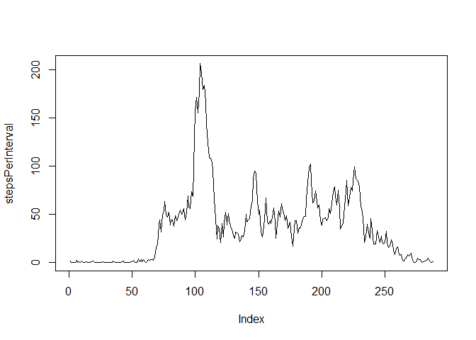
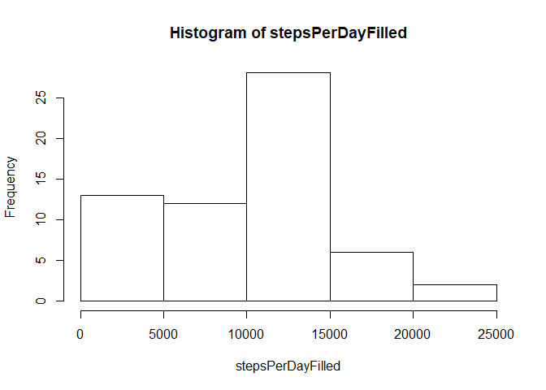
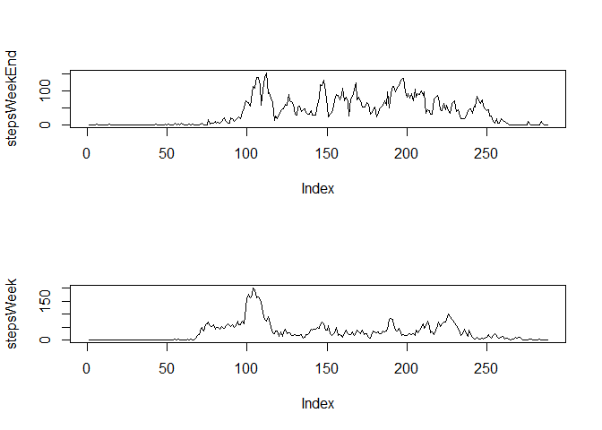

## Loading and preprocessing the data

```r
acti <- read.csv("activity.csv")
acti$date <- as.Date(acti$date)
```


## What is mean total number of steps taken per day?

```r
stepsPerDay <- tapply(acti$steps, acti$date, sum, na.rm = TRUE)
hist(stepsPerDay)
```

<!-- -->

```r
mean(stepsPerDay)
```

```
## [1] 9354.23
```

```r
median(stepsPerDay)
```

```
## [1] 10395
```


## What is the average daily activity pattern?

```r
stepsPerInterval <- tapply(acti$steps, acti$interval, mean, na.rm = TRUE)
plot(stepsPerInterval, type="l")
```

<!-- -->

```r
max(stepsPerInterval)
```

```
## [1] 206.1698
```

```r
which.max(stepsPerInterval)
```

```
## 835 
## 104
```


## Imputing missing values

```r
dim(acti[ which( is.na(acti$steps) |  is.na(acti$date) | is.na(acti$interval) ), ] )[1]
```

```
## [1] 2304
```

```r
actiFilled <-acti
meanPerDay <- tapply(acti$steps, acti$date, mean, na.rm = TRUE)
meanPerDay[is.na(meanPerDay)] <- 0
for (i in 1:dim(actiFilled)[1]) { if (is.na(actiFilled[i,1])) { actiFilled[i,1] <- meanPerDay[as.character(actiFilled[i,2])] } }
stepsPerDayFilled <- tapply(actiFilled$steps, actiFilled$date, sum, na.rm = TRUE)
hist(stepsPerDayFilled)
```

<!-- -->

```r
mean(stepsPerDayFilled)
```

```
## [1] 9354.23
```

```r
median(stepsPerDayFilled)
```

```
## [1] 10395
```
Missing values were replaced with the mean for that day. But missing values do only appear for days with step-sum and step-mean 0. This is why the histogram, the mean and the median for the filled data set is as before.


## Are there differences in activity patterns between weekdays and weekends?

```r
actiFilled$indicator <- rep("empty", dim(actiFilled)[1])
for (i in 1:dim(actiFilled)[1]) { if ( weekdays(actiFilled[i,2]) == "Saturday" | weekdays(actiFilled[i,2]) == "Sunday" | weekdays(actiFilled[i,2]) == "Samstag" | weekdays(actiFilled[i,2]) == "Sonntag" ) { actiFilled[i,4] <- "weekend" } else { actiFilled[i,4] <- "weekday" } }
actiWeek <- actiFilled[ which(actiFilled$indicator=="weekday") , ]
actiWeekEnd <- actiFilled[ which(actiFilled$indicator=="weekend") , ]
stepsWeek <- tapply(actiWeek$steps, actiWeek$interval, mean, na.rm = TRUE)
stepsWeekEnd <- tapply(actiWeekEnd$steps, actiWeekEnd$interval, mean, na.rm = TRUE)
par(mfrow=c(2,1)) 
plot(stepsWeekEnd, type="l")
plot(stepsWeek, type="l")
```

<!-- -->

